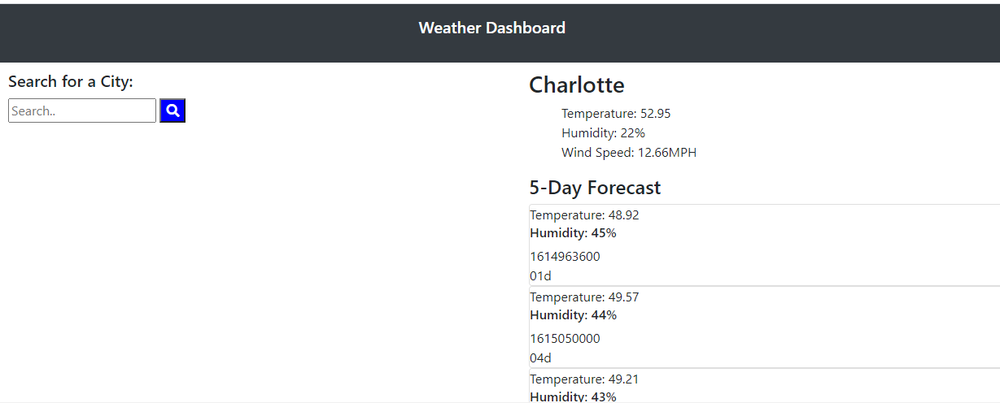

# Weather Dashboard

## Task

To build a weather dashboard that will run in the browser and feature dynamically updated HTML and CSS using the [OpenWeather API](https://openweathermap.org/api) to retrieve weather data for cities.

## Reason for task

To pull information from an existing weather API's

## Acceptance Criteria

```
GIVEN a weather dashboard with form inputs
WHEN I search for a city
THEN I am presented with current and future conditions for that city and that city is added to the search history
WHEN I view current weather conditions for that city
THEN I am presented with the city name, the date, an icon representation of weather conditions, the temperature, the humidity, the wind speed, and the UV index
WHEN I view the UV index
THEN I am presented with a color that indicates whether the conditions are favorable, moderate, or severe
WHEN I view future weather conditions for that city
THEN I am presented with a 5-day forecast that displays the date, an icon representation of weather conditions, the temperature, and the humidity
WHEN I click on a city in the search history
THEN I am again presented with current and future conditions for that city
```

### Technologies and Skills:
* API call 

### Functionality:


### Deployment:
* The URL of the functional, [deployed](https://tweeks07.github.io/Weather-App/) application.

* The URL of the GitHub [repository](https://github.com/tweeks07/Weather-App)